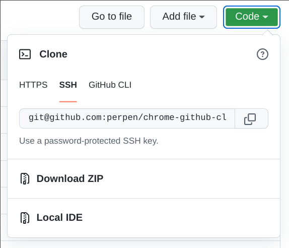

chrome-github-cloner
====================

Chrome extension adding a "Local IDE" button to github repo pages, which when clicked
starts any program on with the git url.



Tested on macOS, Linux. For Windows please submit PR, see below.

Requirements
------------

- Chrome
- Python 2.7 (didn't use v3 b/c of availability issues at my workplace)

1 Install the host script
--------------------------

First install the script which will be invoked by the extension.
When you run the script with the `install` param, it will:

- Copy itself to $HOME/.chrome-github-cloner.py
- Copy to your chrome config directory a manifest file allowing the extension to
  run the script

The chrome config dir depends on your OS, Chrome/Chromium distribution, etc.

```shell
$ git clone https://github.com/perpen/chrome-github-cloner.git
# or with ssh:
$ git clone git@github.com:perpen/chrome-github-cloner.git
# The last param should point to your chrome config dir
$ python2 chrome-github-cloner/bridge.py install ~/.config/google-chrome
```

If this last command fails, it means the script does not know about your OS (eg
Windows). This should be easy to fix, look for `linux` in `bridge.py`, and refer
to <https://developer.chrome.com/apps/nativeMessaging#native-messaging-host-location>

2 Install the extension
------------------------

The Web Store rejected the extension, probably because it invokes an external
program on the host? No reason was given.

Then you have to load it "unpacked":

- Open chrome://extensions
- Switch to "Developer mode" using the toggle top-right
- Click on "Load unpacked" and navigate to the directory you cloned above.
- Configure the command for starting your IDE in the extension's
  options. To access the options page, click on the "..." menu to the right of
  the extension entry, and select "Options"
  `%s` is a placeholder for the git url.

3 Examples of commands
----------------------

You could use something like:
```
#!/bin/bash
git_url="$1"
# Path to clone into
dir="$HOME/$(echo "$git_url" | sed -r 's#^.*github.com:([^/]+)/([^.]+)\.git$#\1-\2#')"
[[ -d "$dir" ]] || git clone "$git_url" "$dir"
# Open your IDE
code "$dir"
```

Troubleshooting
---------------

The output of the commands run by the host script is visible in the console of
the github page. You can press F12 to open the console.

For problems with the extension itself, you may have to open its background page,
from chrome://extensions

The python script logs to ~/.chrome-github-cloner.py.out

The extension will require updates when the github pages change significantly.

Security
--------

If you set the IDE command to `rm -rf /` you will have a problem.

I cannot think of any specific security risk.

Improving the extension
-----------------------

Writing a Chrome extension is quite easy, if a bit convoluted.

- `content.js`: Will run in the page, communicate with the background page.
- `background.js`: The main code for the extension. Has access to most of the
  Chrome API, and is able to communicate with our process running on the host
  (meaning: the machine running Chrome)
- `bridge.py`: A program running on the host, w/o any Chrome sandboxing and
  which can do anything the user can. On request from the background page it
  will run git, and start the IDE.

The communication between these components is done via simple messaging
protocols.

TODO
----

- Read <https://developer.chrome.com/extensions/overview>
- Review advice on <https://developer.chrome.com/extensions/devguide>
- Remove logging to console, and fix logging to .out file
- Port bridge.py to python 3
- Use selected branch or tag?
- Make options into a popup - check popup.js, why not working?
  Read <https://developer.chrome.com/extensions/pageAction>
- Icons
